Práctica 3 – Creación de volúmenes para persistir bases de datos en Docker
1. Titulo
Persistencia de datos en contenedores PostgreSQL mediante volúmenes en Docker

2. Tiempo de duración
Tiempo utilizado: 30 minutos

3. Fundamentos:
Docker es una plataforma de virtualización ligera que permite empaquetar aplicaciones y sus dependencias dentro de contenedores, garantizando su ejecución uniforme en diferentes entornos. Un contenedor es una instancia aislada que ejecuta un servicio o aplicación, mientras que una imagen es la plantilla base que contiene el sistema de archivos y las configuraciones necesarias.

Uno de los retos en el uso de contenedores es la persistencia de datos. Por defecto, los datos almacenados dentro de un contenedor desaparecen cuando este se elimina. Para evitar esta pérdida, Docker implementa los volúmenes, que son áreas de almacenamiento permanentes que residen fuera del ciclo de vida de los contenedores, en el sistema anfitrión.

En esta práctica, utilice un contenedor con PostgreSQL, un sistema de gestión de bases de datos relacional de código abierto. Se demostró la diferencia entre crear un contenedor con y sin volumen.  
Cuando el contenedor se ejecuta sin volumen, la información de la base de datos se elimina al destruir el contenedor. En cambio, al usar un volumen, los datos permanecen accesibles incluso después de eliminarlo y recrearlo.

En el contexto de la computación moderna, los volúmenes resultan esenciales para ambientes de desarrollo y producción, pues permiten mantener información crítica, realizar backups y compartir datos entre contenedores. Su utilización está alineada con las buenas prácticas de DevOps, al promover la portabilidad y la resiliencia del sistema.

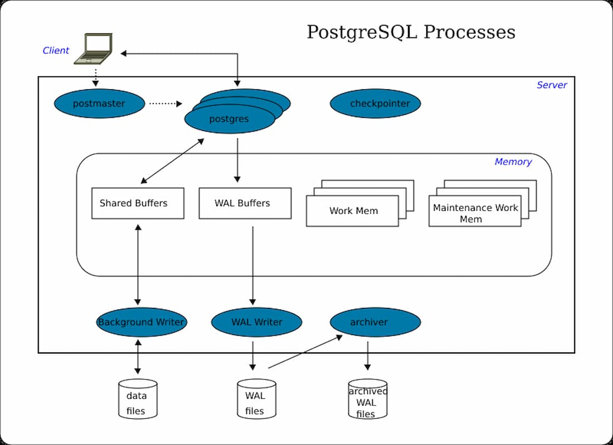
Figura 1-1.Diagrama Docker

4. Conocimientos previos.

Para realizar esta práctica, debemos tener claro los siguientes temas:
- Comandos básicos de Linux (CLI): `docker run`, `docker ps`, `docker exec`, `docker stop`, `docker rm`, `docker volume create`.
- Manejo de navegadores web y descarga de instaladores.
- Conceptos de bases de datos relacionales.
- Uso del cliente psql para ejecutar sentencias SQL básicas.
- Conexión entre Docker Desktop y WSL 2 en Windows 10/11.

5. Objetivos a alcanzar
- Implementar contenedores Docker que ejecuten PostgreSQL.  
- Comprobar la pérdida de datos en contenedores sin volumen.  
- Crear volúmenes persistentes en Docker para conservar la información almacenada.  
- Analizar el comportamiento de la base de datos al eliminar y recrear contenedores.  
- Elaborar un informe técnico en formato Markdown siguiendo las normas establecidas por la asignatura.

6. Equipo necesario:
- Computador con sistema operativo Windows 11 Pro.  
- Docker Desktop v4.48.0 instalado.  
- WSL2.  
- Visual Studio Code 
- Conexión a Internet para descargar imágenes desde Docker Hub.

7. Material de apoyo.
- Documentación oficial de Docker: [https://docs.docker.com](https://docs.docker.com)  
- Guía de asignatura de Tendencias Tecnológicas  
- Cheat Sheet de comandos Linux  
- Artículos científicos sobre virtualización y contenedores:  
- Rastogi, S., Duttagupta, S. P., & Guha, A. (2024). *Design and Implementation of a Self-Supervised Algorithm for Vein Structural Patterns Analysis Using Advanced Unsupervised Techniques.Machine Learning and Knowledge Extraction, 6(2), 1193–1209.  .  

8. Procedimiento

-Paso 1:  Crear base de datos sin volumen
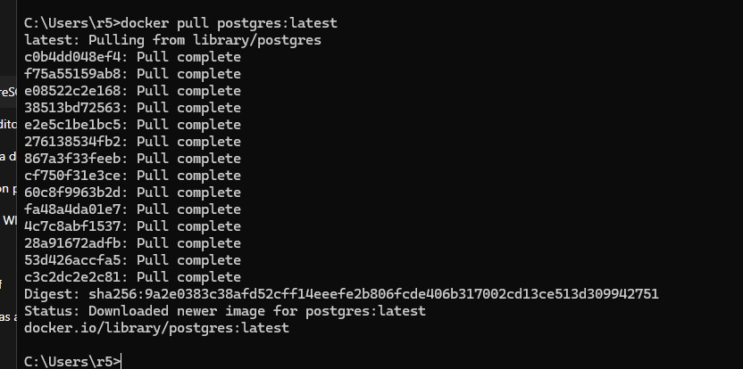

-Paso 2: Crear un contenedor sin volumen
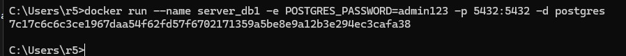

-Paso 3: Ingresar al contenedor
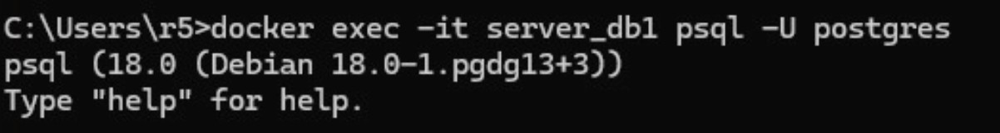

-Paso 4: Crear base de datos y tabla
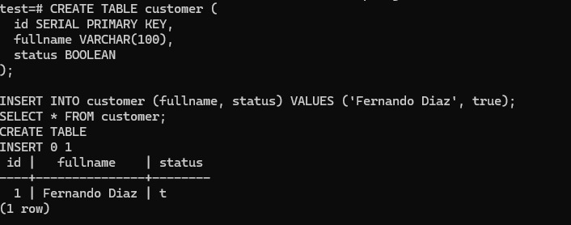

-Paso 5: Eliminar el contenedor y recrearlo
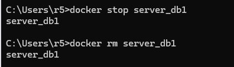

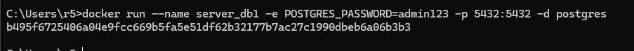
La base de datos test desaparece. Los datos no persisten al eliminar el contenedor.

-Paso 6: Crear otro volumen Docker
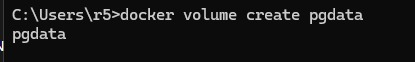

-Paso 7: Ejecutar un contenedor usando el volumen
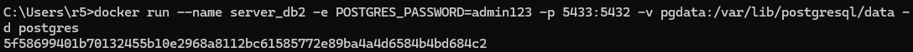

-Paso 8: Crear la base y la tabla
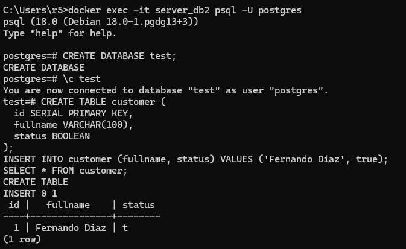

-Paso 9: Eliminar el contenedor y recrearlo
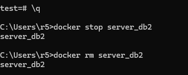

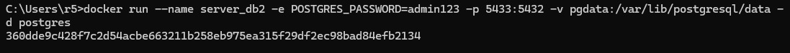

-Paso 10: Verificar persistencia de datos
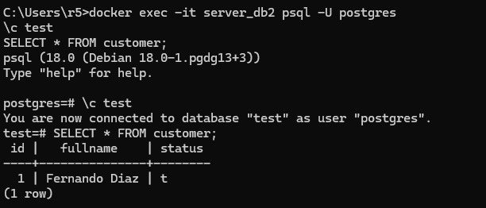

9. Resultados esperados:
Al finalizar la práctica:

Sin volumen: los datos se pierden al eliminar el contenedor.

Con volumen: los datos persisten al recrearlo.

Docker permite gestionar entornos de base de datos reproducibles y duraderos.

10. Bibliografía
Docker Inc. (2025). Docker Documentation. Recuperado de: https://docs.docker.com

PostgreSQL Global Development Group. (2025). PostgreSQL Documentation.

Rastogi, S., Duttagupta, S. P., & Guha, A. (2024). Design and Implementation of a Self-Supervised Algorithm for Vein Structural Patterns Analysis Using Advanced Unsupervised Techniques. Machine Learning and Knowledge Extraction, 6(2), 1193–1209.

Cabero, J., & Llorente, M. (2023). Competencias digitales y entornos virtuales de aprendizaje. Ediciones Pirámide.